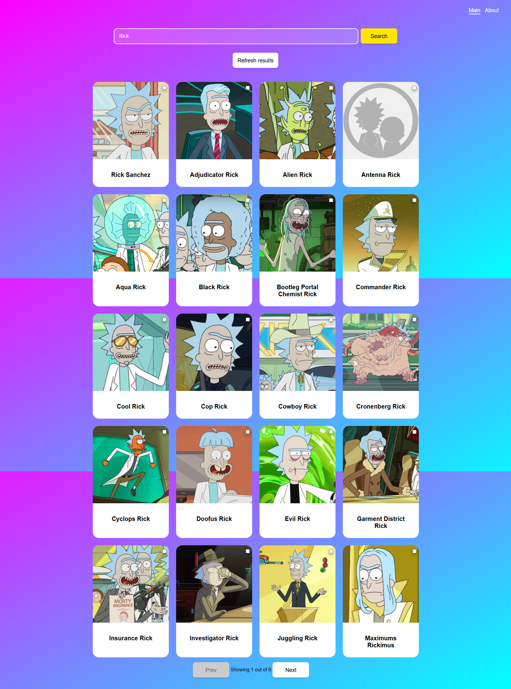
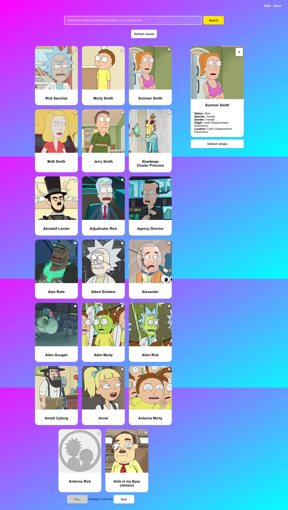
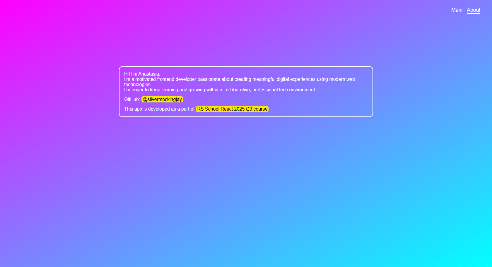

# Rick and Morty characters search
This is a React app to search for characters of Rick&Morty galaxy

## Deployment
https://my-react-app-rm.netlify.app/

## Preview







## Features
- Character search functionality for the Rick & Morty API, displaying the first page results by default
- Integrated RTK Query for API requests with caching and manual refresh of search results
- Synced search queries and current page with the URL
- Persisted recent search query in Local Storage to restore user state between sessions
- Navigation is implemented with React Router
- Managed global state of selected character cards using Redux Toolkit
- Created a split-page layout with React Router Outlet to display search results alongside detailed character information
- Implemented pagination
- User is allowed to select, unselect and download character cards
- Implemented three pages: Search page, About, Not Found page
- Interactive UI with smooth transitions and dynamic updates

## Technologies used
- React
- TypeScript
- Vite
- React Router
- Redux Toolkit & React-Redux
- ESLint & Prettier
- Husky
- Vitest
- Testing Library
- Netlify

## Available scripts
`npm run dev`

Starts the development server

`npm run build`

Builds the project for production, using Vite

`npm run preview`

Serves the production build locally to test it before deployment

`npm run lint`

Runs ESLint on all files to detect code issues

`npm run format:fix`

Formats all files using Prettier

`npm run prepare`

Sets up Husky git hooks

`npm run test`

Runs all tests with Vitest

`npm run test:coverage`

Runs tests and generates a coverage report

## Installation
1. Clone the repository
```
git clone git@github.com:silvermockingjay/react-projects.git
cd react-projects
git checkout api-queries
```

2. Install the dependencies
```
npm install
```
