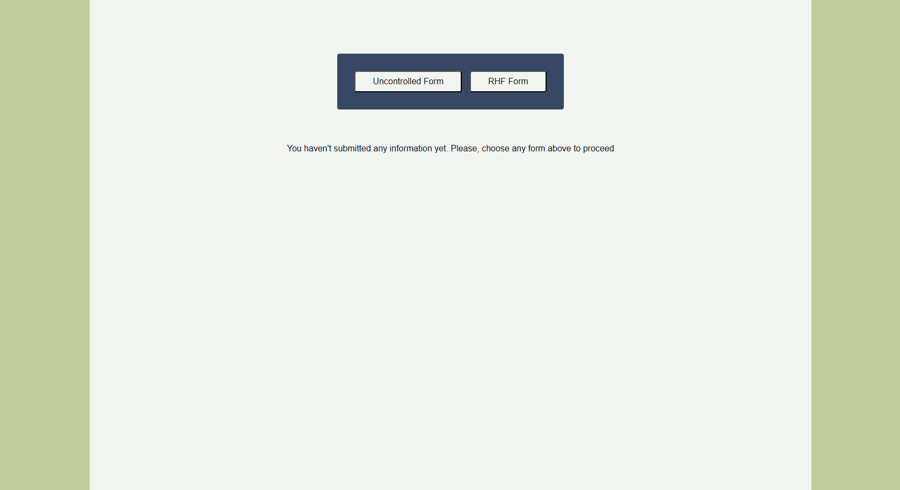
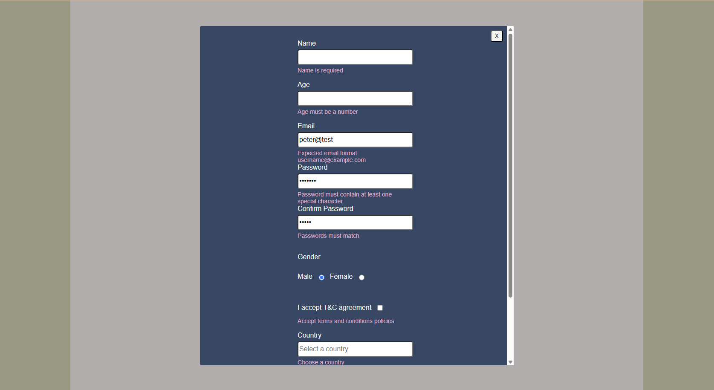
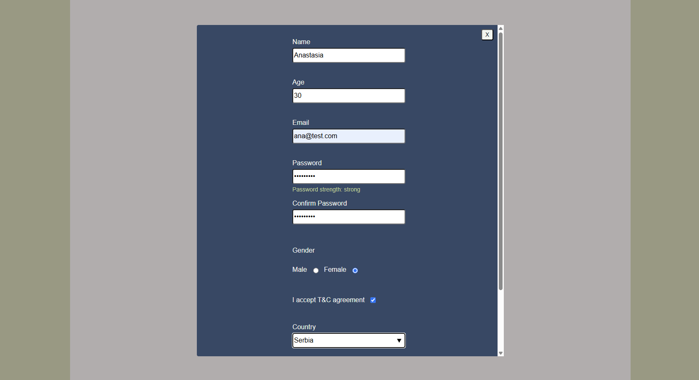
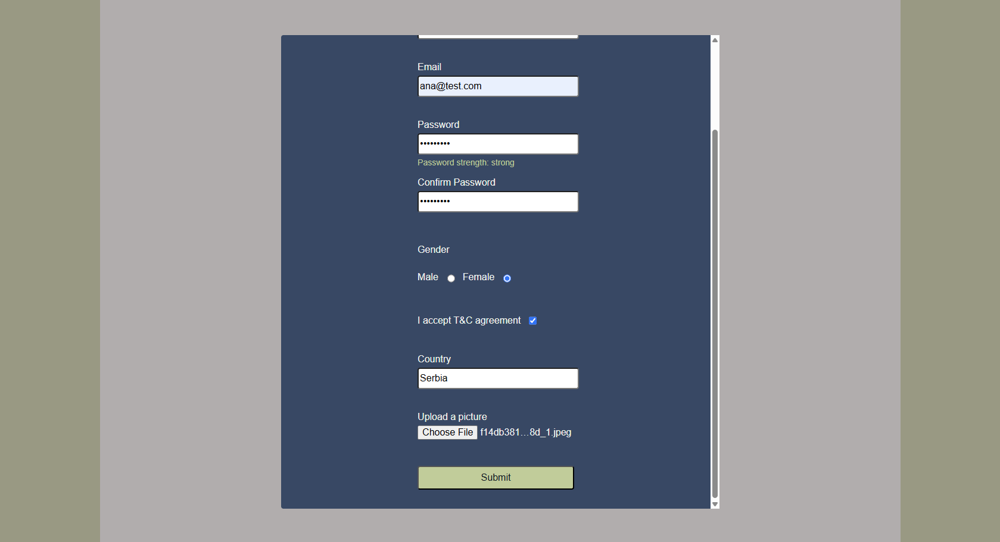
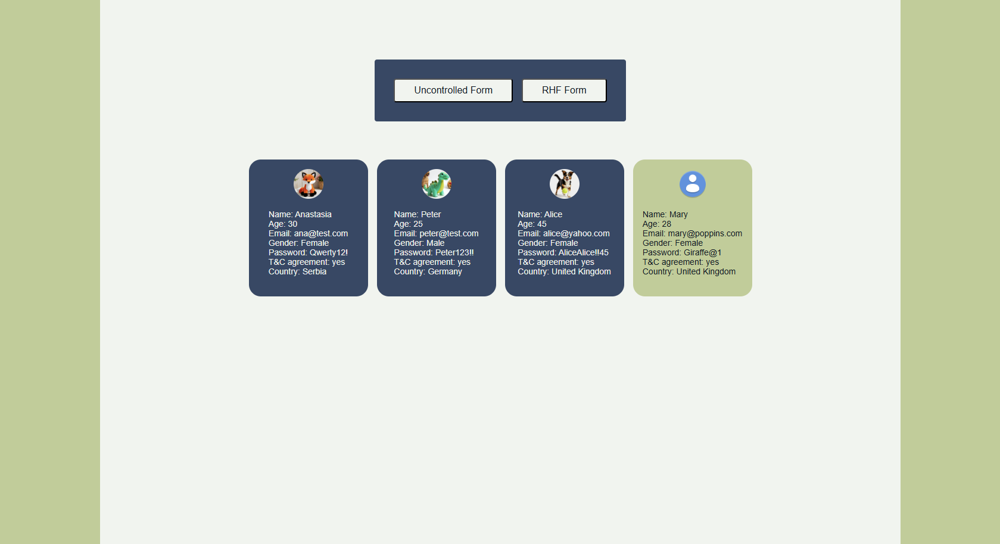

# React forms

This is a project for RS School React course 2025 Q3 [task](https://github.com/rolling-scopes-school/tasks/blob/master/react/modules/tasks/forms.md) to demonstrate the difference between general uncontrolled form and RHF form usage.


## Deployment
https://react-forms-project.netlify.app/

## Preview








## Features
- Main page with forms options
- General uncontrolled form and RHF Form
- Universal, accessible modal with React Portal (reusable for both controlled and uncontrolled forms)
- State Management set up with Redux to collect data from both forms
- Cards with uploaded data, newly entered card has a primary background color
- Client side validation (RHF Form is validated live while general uncontrolled form - on submit)
- Password strength indicator

## Technologies used
- React
- TypeScript
- Vite
- Redux Toolkit & React-Redux
- React Hook Form
- Yup
- ESLint & Prettier
- Husky
- Netlify

## Available scripts
`npm run dev`

Starts the development server

`npm run build`

Builds the project for production, using Vite

`npm run preview`

Serves the production build locally to test it before deployment

`npm run lint`

Runs ESLint on all files to detect code issues

`npm run format:fix`

Formats all files using Prettier

`npm run prepare`

Sets up Husky git hooks

## Installation
1. Clone the repository
```
git clone git@github.com:silvermockingjay/react-projects.git
cd react-projects
git checkout forms
```

2. Install the dependencies
```
npm install
```
